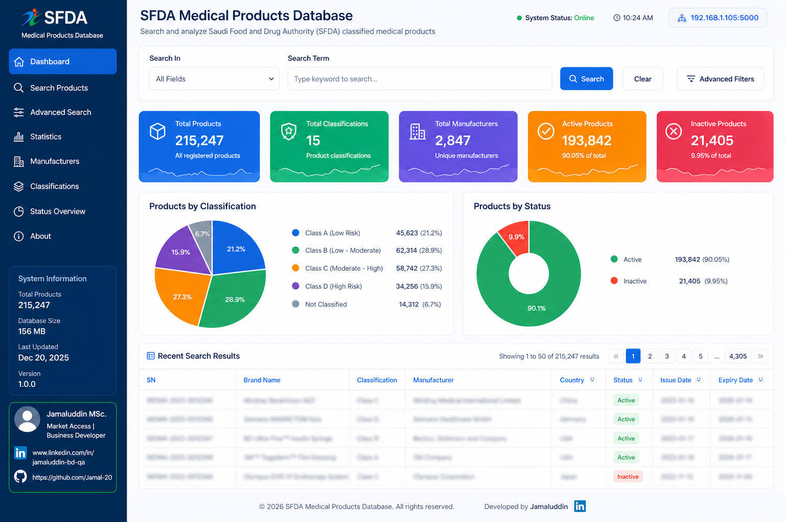

# 🏥 SFDA Medical Products Database

A powerful, user-friendly web application for searching and analyzing Saudi Food and Drug Authority (SFDA) classified medical products. The SFDA Medical Products Database is not just a search tool — it is a market intelligence engine designed to transform regulatory data into strategic insights.

This project was developed to support market access teams, regulatory specialists, and procurement decision-makers by providing:

-----
## 🖥️ Desktop Environment / Interface



**Enterprise-grade dashboard for SFDA medical product intelligence and regulatory analysis.**

### 🎛️ Interface Overview
- 🔐 Local & secure (no cloud exposure)
- 🛡️ Controlled data visibility for compliance
- 📊 Active vs Inactive product tracking
- 🏭 Manufacturer & country traceability
- 🧾 Classification-based regulatory insights
----

📖 The platform bridges the gap between raw regulatory data and business decision-making, enabling organizations to move from data collection → insight generation → strategic action.

## 🛠️ Installation
1. Clone the repository:
   ```bash
   git clone https://github.com/Jamal-20/SFDA_MD_Databases.git
   ```
2. Navigate to the project directory:
   ```bash
   cd SFDA_MD_Databases
   ```
3. Install the required dependencies:
   ```bash
   pip install -r requirements.txt
   ```
4. Build Executable
```bash
   pip install pyinstaller
   pyinstaller --onefile --name=SFDA_Database --add-data=sfda_products.xlsx;. sfda_complete.py
   ```
## 🎯 Usage
- To start the application, run the following command:
  ```bash
  python app.py
  ```
- 🌐 Access the application at `(http://127.0.0.1:5000)` in your web browser.

## 📁 Project Structure
```
SFDA_MD_Databases/
|-- app.py          # Main application file
|-- config.py       # Configuration settings
|-- requirements.txt # Required Python packages
|-- README.md       # Documentation file
```
📊 Performance Benchmarks


## 🤝 Acknowledgments
[Saudi Food and Drug Authority (SFDA)](https://www.sfda.gov.sa/en) for data classification standards

## 👤 Contact Information  
- For questions or suggestions, please contact:
- LinkedIn: [Jamaluddin|R&D|BD|MarketAccess](www.linkedin.com/in/jamaluddin-microbiology-qa)
  

